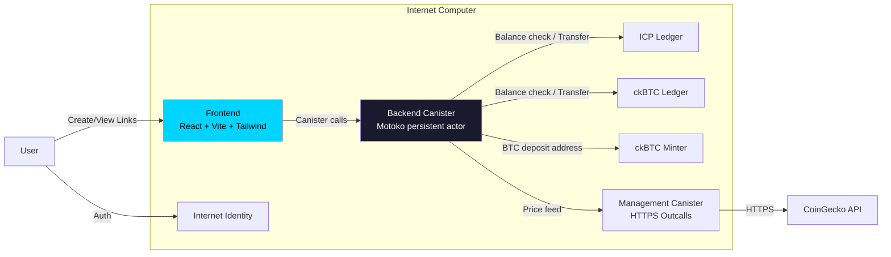

# ChainPay

**Cross-chain payment links on the Internet Computer. Create shareable links that accept ICP and ckBTC, verified natively by a single canister.**

> Live at [5tzwh-jqaaa-aaaas-qgf6q-cai.icp0.io](https://5tzwh-jqaaa-aaaas-qgf6q-cai.icp0.io/)
>
> Built for Day 3 of the [ICP Agentic DevX Skills Test](https://skills.internetcomputer.org) - the Agent Autonomy Challenge. A single high-level prompt, minimal hand holding, maximum ICP skill coverage.

## How It Works

1. **Sign in** with Internet Identity
2. **Create a payment link** - set title, amount, currency (ICP or ckBTC), optional expiry
3. **Share the link** - each link has a unique payment address (canister subaccount)
4. **Receive payment** - payer sends tokens to the link's address, then confirms. Funds auto-forward to the creator.

Payment pages are also served directly from the backend canister via `http_request` at `/pay/{id}` - no frontend needed.

## Architecture



Each payment link gets a unique **subaccount** derived from its ID. Payers send tokens to `(canister_id, subaccount)`. On confirmation, the canister verifies the balance via the ICRC-1 ledger, records the payment, and forwards funds to the creator's account.

## ICP Skills Used

This project exercises **9 ICP skills** - the most of any day:

| Skill | How It's Used |
|-------|--------------|
| `icp-cli` | Project scaffolding, build, deploy, cycles management |
| `motoko` | Backend language with persistent actor, mo:core collections |
| `canister-security` | Anonymous principal rejection, owner-only guards, input validation |
| `icrc-ledger` | ICP + ckBTC balance checks, ICRC-1 transfers with subaccounts |
| `ckbtc` | BTC deposit address generation via minter, ckBTC payment flow |
| `internet-identity` | Frontend authentication via `@icp-sdk/auth` |
| `stable-memory` | Persistent actor pattern - all state survives upgrades |
| `https-outcalls` | USD price feed from CoinGecko with transform function |
| `multi-canister` | Backend calls ICP Ledger, ckBTC Ledger, ckBTC Minter, Management Canister |

## Stack

| Layer | Technology |
|-------|-----------|
| Backend | Motoko (persistent actor, mo:core 2.3.1, moc 1.3.0) |
| Frontend | React 19 + Vite 7 + Tailwind CSS 4 |
| Auth | Internet Identity via `@icp-sdk/auth` |
| Bindings | `@icp-sdk/bindgen` (Vite plugin + CLI) |
| Testing | PICjs (`@dfinity/pic`) + Vitest (31 tests) |
| Tooling | icp-cli 0.2.2 |

## Test Suite

31 PICjs tests covering:

- Link creation (validation, auth, sequential IDs)
- Link retrieval (public access, not-found handling)
- Payment addresses (unique subaccounts per link)
- User isolation (myLinks only shows caller's links)
- Link lifecycle (deactivate/reactivate, owner-only guards)
- Expiry enforcement (time advancement in PocketIC)
- Stats endpoint
- HTTP interface (payment pages, stats JSON, 404s, inactive links)
- Payment history access control

```
 PASS  chainpay.spec.ts (31 tests) 1089ms
 Test Files  1 passed (1)
      Tests  31 passed (31)
```

## Running Locally

```bash
# Prerequisites: Node.js 22+, icp-cli, mops

# Install backend deps
cd backend && mops install && cd ..

# Install frontend deps
cd frontend && npm install && cd ..

# Start local network with Internet Identity
icp network start -d

# Build and deploy
icp deploy

# Run tests
cd tests && npm install && npm test
```

## Deploying to Mainnet

```bash
# Mint cycles from ICP
icp cycles mint --icp 0.7 -e ic

# Deploy
icp deploy -e ic

# Create a test payment link
icp canister call backend createLink \
  '(record { title = "My Invoice"; description = "Payment for services"; amount = 100_000_000 : nat; method = variant { icp }; expiresAt = null })' \
  -e ic
```

## Canister IDs (Mainnet)

| Canister | ID |
|----------|-----|
| Backend | `52253-7yaaa-aaaas-qgf7a-cai` |
| Frontend | `5tzwh-jqaaa-aaaas-qgf6q-cai` |
